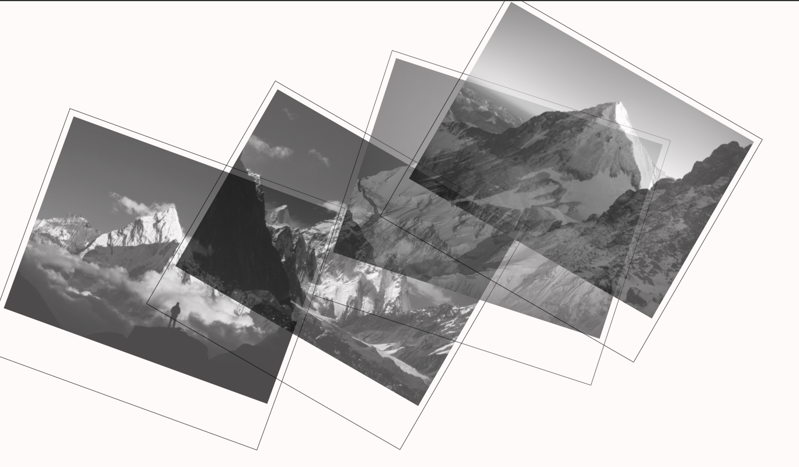
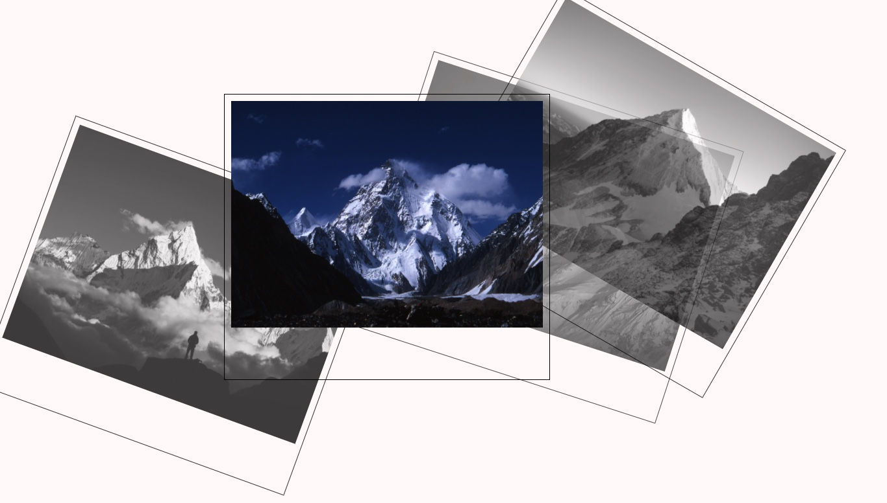

## Picture Gallery

[Test this app yourself](maykaltenev.github.io/webpage-pictures/)

---

### About Project

The Webpage with the four highest peaks in the world Everest (8,850 metres), K2(8,611 metres), Kangchenjunga (8,586 metres) and Lhotse (8,516 metres);

### How to use this Project

The website is a tribute to the mountains! <i> I do not own the copyright for the photos, they are used only for study purpose! </i>  The polaroid photos are made with: filter: grayscale(100), z-index and opacity;
On hover they are colored and have a bouncy animation made with transform, as seen on the photo below.

##### Developed With

- [x] _HTML5_
- [x] _CSS3_
- [ ] _SASS_
- [ ] _SCSS_
- [ ] _React_
- [ ] _Bootstrap_
- [x] _npm_

---

### Contact

Mail: <michaeltenev@mail.com> 
GitHub: [michaeltenev](https://github.com/maykaltenev) 
LinkedIn: [Maykal Tenev](https://www.linkedin.com/in/maykal-tenev-a8729586/)

---

### Used Tools

- [Visual Studio Code](https://code.visualstudio.com/)

### Recourses

- [MDN Web Docs](https://developer.mozilla.org/de/)

---

Made with ❤️ by me
